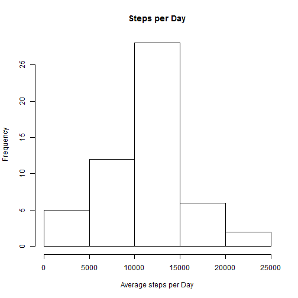
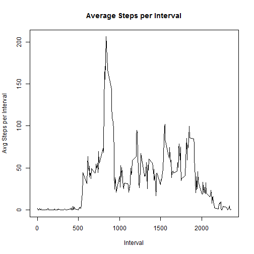
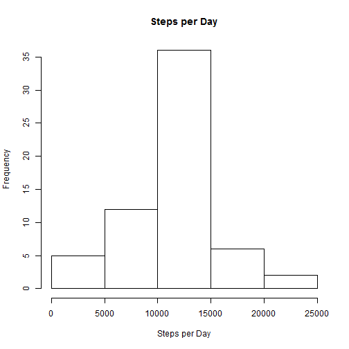
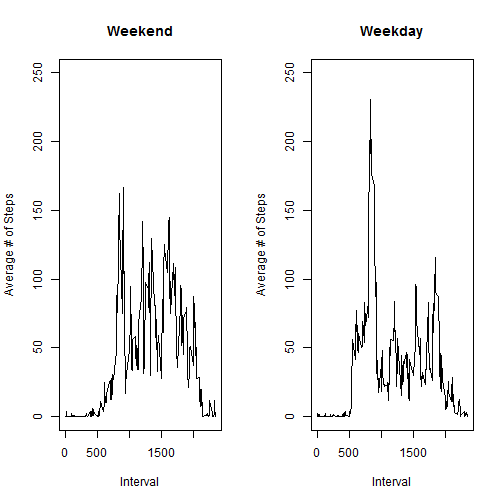

Reproducible Research Project: Peer Assessment #1
================================
File: PA1_template.Rmd  
Date: 8/16/2015  
Source data is .csv file of activity (number of steps) in five-minute intervals  
by day collected over two months for one individual


```r
options(scipen=1,digits=2)
```
Libraries required for this analysis  
- lubridate  
- dplyr  
- ggplot2  
- knitr


### Task 1: Load the data if not already loaded.  


```r
# Download and unzip file if not already in working dir
if(file.exists("activity.csv")==FALSE)
  {
	data_url = "https://d396qusza40orc.cloudfront.net/repdata%2Fdata%2Factivity.zip"
	setInternet2(use=TRUE)
	download.file(data_url,"data_file.zip",method="internal")
	unzip("data_file.zip")
	}
#
# load data if not already done
if(exists("mydata_raw")==FALSE)
	{
	myfile = "activity.csv"
	mydata_raw <- read.csv(myfile)
	}
```

### Task 2: Analyze mean total number of steps/day, ignoring NA values  

Subset to those records with steps != NA, calc total number of steps by date and plot histogram.


```r
# Ignore steps that are NA
# Subset to drop records with steps = NA
mydata <- subset(mydata_raw,!is.na(steps))
#
# Group by date
mydata_grouped <- group_by(mydata,date)
#
# Calc total number of steps taken per day and create histogram
mydata_sum_day <- summarise(mydata_grouped,steps_sum=sum(steps))
hist(mydata_sum_day$steps_sum,xlab="Average steps per Day",ylab="Frequency",main="Steps per Day")
```

 

Also report the mean and median steps taken per day

```r
mean_steps_per_day <-mean(mydata_sum_day$steps_sum)
median_steps_per_day <- median(mydata_sum_day$steps_sum)
```
The mean steps per day is 10766.19.
The median steps per day is 10765

### Task 3: Analyze average daily activity pattern by interval, ignoring NA values  

Plot average steps per interval, averaged across all days.
Interval notation is timestamp; i.e., 1600 corresponds to the 5-minute interval starting at 4pm.

```r
# Group by interval.  There are 288 five-minute intervals in a day
mydata_grouped_int <- group_by(mydata,interval)
mydata_avg_int <- summarise(mydata_grouped_int,steps_int=mean(steps))
#
# Line plot of average steps per interval, averaged across all days
plot(mydata_avg_int$interval,mydata_avg_int$steps_int,type="l",xlab="Interval",ylab="Avg Steps per Interval",main="Average Steps per Interval")
```

 

Also report the interval that had the maximum average steps

```r
max_steps_int <- max(mydata_avg_int$steps_int)
max_interval <- subset(mydata_avg_int,mydata_avg_int$steps_int==max_steps_int)
```
Interval with maximum steps is 835.

### Task 4: Determine the number of intervals with NA values


```r
#------------------------------------------------------------
# Calc number of intervals with NA
#------------------------------------------------------------
# Number of NA values in the raw dataset
mydata_na <- subset(mydata_raw,is.na(steps))
na_count <- nrow(mydata_na)
```

Number of NA values is 2304  


### Task 5: Replace intervals of NA steps with mean for that interval over all days


```r
#------------------------------------------------------------
# Impute missing values using the average for that interval
#------------------------------------------------------------
# mydata_raw contains records with the NA steps
# mydata_avg_int contains the average steps per interval
# Replace mydata_raw$steps with mydata_avg_int$steps_int where steps==NA
mydata_impute_na <- mutate(mydata_raw, steps=replace(mydata_raw$steps,is.na(mydata_raw$steps),mydata_avg_int$steps_int))
#
```

### Task 6: Analyze total number of steps/day, with imputed NA values; plot histogram  
Method: replace NA with average steps for that interval, averaged across dates


```r
#------------------------------------------------------------
# Group by date
mydata_grouped_imputed <- group_by(mydata_impute_na,date)
#
# Calc total number of steps taken per day and create histogram
mydata_sum_day_imputed <- summarise(mydata_grouped_imputed,steps_sum=sum(steps))
hist(mydata_sum_day_imputed$steps_sum, xlab="Steps per Day",ylab="Frequency",main="Steps per Day")
```

 

Also report mean and median of total number of steps taken per day

```r
mean_steps_per_day_imputed <-mean(mydata_sum_day_imputed$steps_sum)
median_steps_per_day_imputed <- median(mydata_sum_day_imputed$steps_sum)
```

The mean steps per day using imputed values is 10766.19. (Compare to 10766.19).  
The median steps per day using imputed values is 10766.19  (Compare to 10765).

The mean value does not change when using imputed values.
The median value differs only slightly when using imputed values.

### Task 7: Analyze weekday vs weekend avg steps/interval, with imputed NA values


```r
#------------------------------------------------------------
# mydata_impute_na contains the data
# Define day_type variable
mydata_impute_na$day <- ymd(mydata_impute_na$date)
mydata_impute_na$weekday <- weekdays(mydata_impute_na$day, abbreviate=TRUE)
mydata_impute_na$day_type <- ifelse(mydata_impute_na$weekday %in% c("Sat","Sun"),"weekend","weekday")
#
# Group by interval across day_type.  There are 288 five-minute intervals in a day.
mydata_grouped_day_type <- group_by(mydata_impute_na,day_type,interval)
mydata_avg_day_type_int <- summarise(mydata_grouped_day_type,steps_int=mean(steps))
#
# Line plot of average steps per interval, averaged across all days
par(mfcol=c(1,2))
myplotdata1 <- subset(mydata_avg_day_type_int,day_type =="weekend") 
with (myplotdata1, {
  plot(interval,steps_int,type="l", ylim=c(0,250), xlab="Interval", ylab="Average # of Steps", main="Weekend")
})
myplotdata2 <- subset(mydata_avg_day_type_int,day_type =="weekday") 
with (myplotdata2, {
  plot(interval,steps_int,type="l", ylim=c(0,250), xlab="Interval", ylab="Average # of Steps", main="Weekday")
})
```

 

The highest number of steps are taken weekdays around 8-9am, most likely when the person was going 
to work.  
But in general more steps were taken on the weekend.


### End
